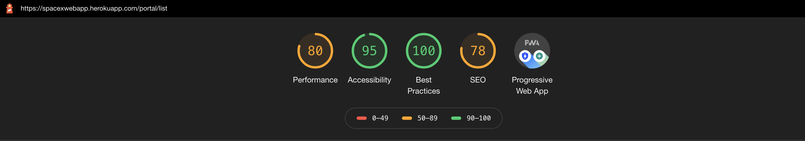
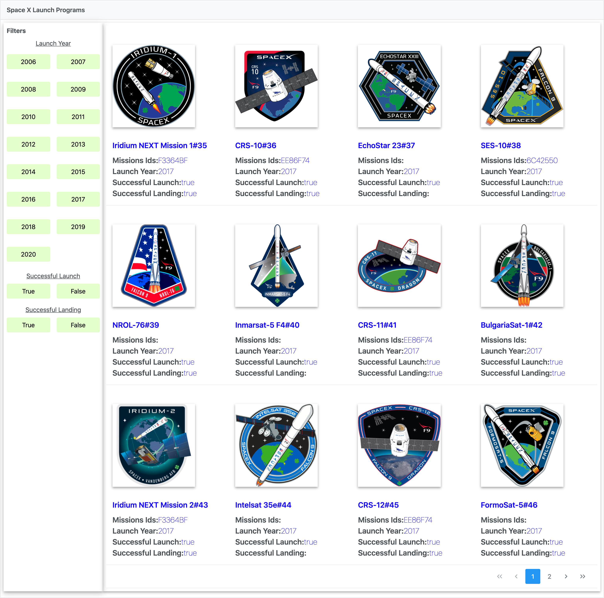
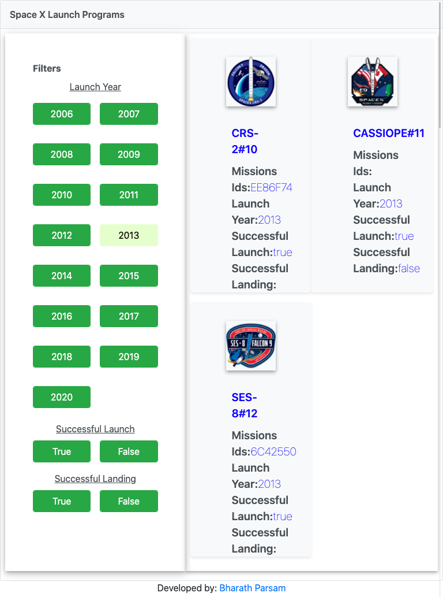
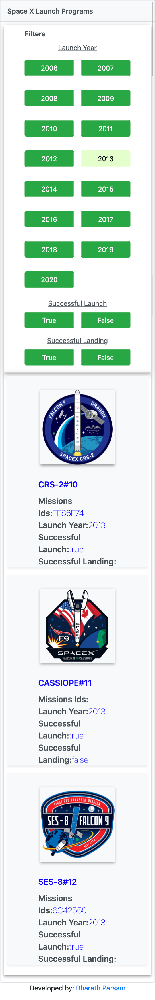

# SpaceX WebApplication

This spaceX web-application allows the user to load the list of spaceX launches.

## Launch Application

[Launch Mission](https://spacexwebapp.herokuapp.com/)

### Table of Contents

- [How to clone the Git Repo](#How-to-clone-the-Git-Repo)
- [Prerequisites](#Prerequisite)
- [Node Modules Installation Steps](#Installation-steps)
- [Running The Development Server](#development-server)
- [Build Commands](#Build)
- [Lighthouse Reports](#Lighthouse-Reports)
- [Device Comptability Screen Shots](#Device-Comptability-Screen-Shots)

---

## How to clone the Git Repo

Click on the code with download icon then click download zip or use clone option if you are cloning using ssh and then use the git clone command to complete the process.

## Prerequisite

1. Node version ^10
2. Angular version ^9

## Installation Steps

Run `npm install` to load all the dependent node modules.

## Development server

Run `npm run serve` for a dev server. Navigate to `http://localhost:4200/`. The app will automatically reload if you change any of the source files.

* * *

## How to clone the Git Repo

Click on the code with download icon then click download zip or use clone option if you are cloning using ssh and then use the git clone command to complete the process.

## Prerequisite

1. Node version ^10
2. Angular version ^9

Run `npm run build` to build the project. The build artifacts will be stored in the `dist/` directory.

## Lighthouse Reports

Lighthouse complete report pdf file is added in the results folder with the name audit-report

The below snippet shows the lighthouse score.

## Device Comptability Screen Shots

### Inital Load 

### Desktop

### Tablet

### Mobile

